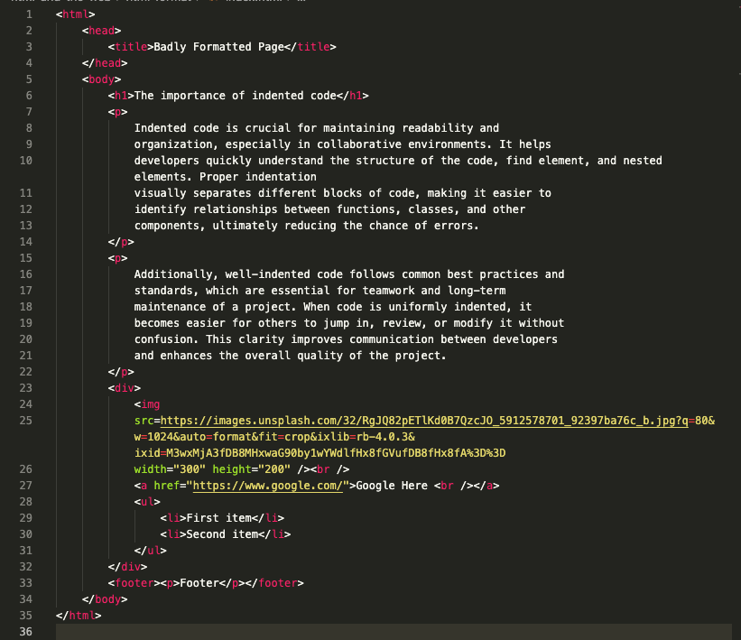

# HTML and the Web: Format Salad

This little challenge checks if you have set up VS Code and Prettier correctly.

## Getting Started with HTML

1. Inside this folder, create the file `index.html`.
2. Inside `index.html`, paste the following code:

   ```html
  
   ```

3. Save the file.
4. Once the file is saved, you should see all the code correctly indented.
   

> If your code hasn't been indented after saving, it means that you haven't configured [Prettier - Code Formatter](https://marketplace.visualstudio.com/items?itemName=esbenp.prettier-vscode) correctly in VS Code. Please go back to the computer setup document and reconfigure Prettier.

Congratulations! 🎉 Prettier is correctly set up!
